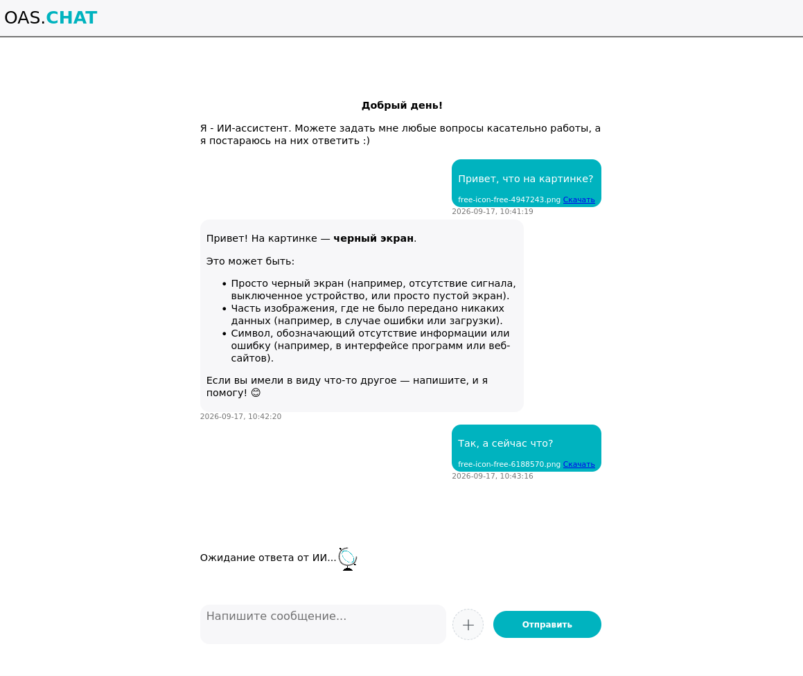

# PocketChat
> Простой клиент для интеграции с ИИ

# Возможности
## Общение с AI

Задавайте вопросы в привычном формате чата и получайте ответы от выбранной AI-модели.

PocketChat подходит как для быстрых вопросов, так и для продолжительных разговоров, где важен контекст предыдущих сообщений.

Можно использовать AI для:

    поиска и объяснения информации;

    написания и редактирования текстов;

    мозгового штурма;

    обучения и изучения новых тем;

    программирования;

    анализа идей;

    решения повседневных задач.

## Работа с изображениями

Прикрепляйте изображения непосредственно к сообщению и просите AI проанализировать их.

Например:

    разобрать фотографию;

    проанализировать скриншот;

    прочитать информацию с изображения;

    объяснить график или схему;

    задать вопросы по содержимому изображения.

## Работа с файлами

Добавляйте файлы непосредственно в разговор.

Файлы могут использоваться как дополнительный контекст для работы с AI, а прикреплённые материалы остаются связаны с соответствующим сообщением.
История разговоров

Пользователь сможет:

    создавать новые разговоры;

    возвращаться к предыдущим;

    продолжать старые диалоги;

    переименовывать чаты;

    удалять ненужные разговоры;

    хранить историю своих взаимодействий с AI.

Персональный аккаунт

В дальнейшем PocketChat будет поддерживать персональные аккаунты.

Аккаунт позволит хранить пользовательские данные отдельно и получать доступ к своим разговорам и настройкам.

## Планируется поддержка:

    профиля пользователя;

    сохранения истории;

    персональных настроек;

    настроек AI;

    управления файлами;

    синхронизации между устройствами.

## Разные AI-модели

PocketChat не ограничивается одной конкретной моделью.

Проект развивается с возможностью использовать разные AI-модели в зависимости от задачи.

Для быстрых вопросов можно использовать одну модель, для программирования или сложного анализа — другую, а для работы с изображениями — мультимодальную модель.

## Идея проекта

PocketChat создаётся не просто как интерфейс для отправки сообщений языковой модели.

Идея проекта — сделать персональное пространство для работы с AI, где всё необходимое находится в одном месте:

    чаты;

    файлы;

    изображения;

    AI-модели;

    профиль пользователя;

    настройки;

    история разговоров.

Вместо отдельных разовых запросов пользователь получает пространство, в котором можно начать разговор, сохранить его и вернуться к нему позже.
Развитие проекта

PocketChat находится в активной разработке.

Проект постепенно развивается от простого AI-чата в полноценное персональное пространство для работы с искусственным интеллектом.

В дальнейшем планируется развитие следующих направлений:

    сохранение истории чатов;

    пользовательские аккаунты;

    синхронизация между устройствами;

    расширенная работа с файлами;

    поддержка различных AI-моделей;

    расширенная работа с изображениями;

    персональные настройки;

    персонализация интерфейса;

    поиск по истории разговоров;

    организация чатов;

    дополнительные AI-инструменты.
